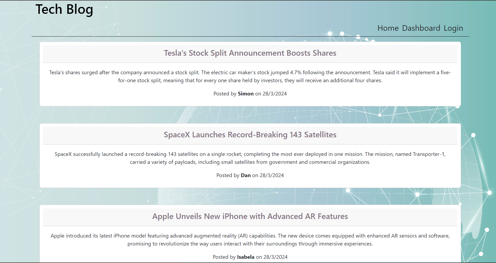
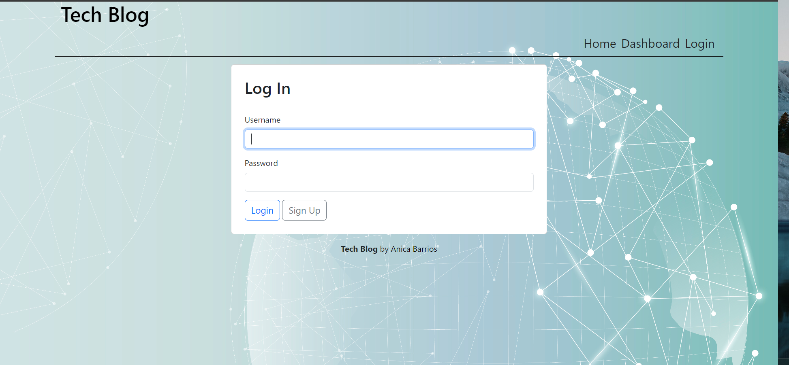
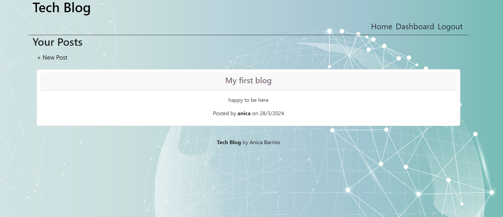
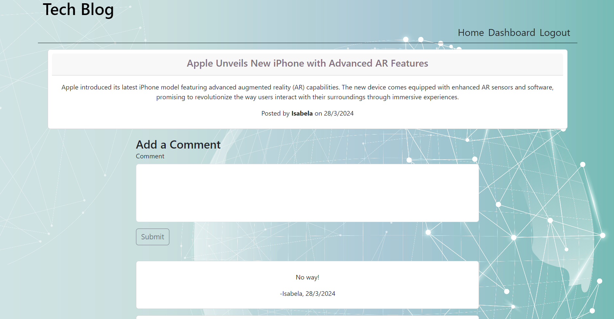
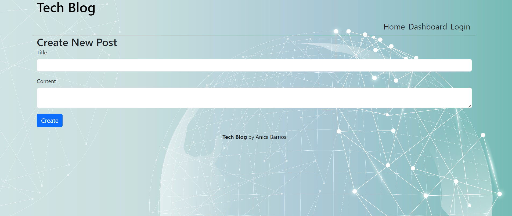
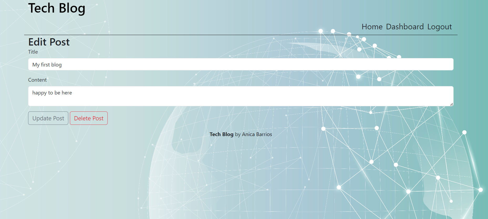

# Tech-Blog

[](https://github.com/siennameow/tech-blog/blob/main/LICENSE)

## Description

Tech Blog provides a content management system (CMS) to run a blog site. Users can log in to publish a post on the site and leave comments on posts. Logged in users have the ability to edit or delete previous posts from their dashboard. Non-logged in users can freely view published posts, but need to sign up to publish posts or leave comments.

Tech Blog is a full stack web application built following the Model View Controller (MVC) design paradigm. It uses MySQL and Sequelize for model definition and interaction, handlebars.js as the HTML view templating engine, and express.js for the server. The site uses cookies and session data to restrict access to publishing posts and comments to logged in users.

The web application is hosted on Heroku. Link to deployed website:

## Table of Contents

* [Application Preview ](#application-preview-)
* [Features](#features-)
* [Code Snippet](#code-snippet-)
* [Installation](#installation-)
* [Usage](#usage-)
* [Technologies](#technologies-)
* [Questions](#questions-)

## Application Preview 

Application Preview:

Homepage


Login Page



Logged in user feature:
| Dashboard | Comment post|
|-----------|-----------|
| ||

| Add post | Edit/delete post|
|-----------|-----------|
| | |
## Features 

⚡️ User-Friendly Interface\
⚡️ Data Collection and Caching\
⚡️ Security\
⚡️ Social Integration\
⚡️ Simplicity

## Code Snippet 

API Routes
The PUT `/api/posts/:id` route update selected post(by `id`) data with new data

```JavaScript
router.put('/:id', withAuth, (req, res) => {
    Post.update({
            title: req.body.title,
            content: req.body.content
        }, {
            where: {
                id: req.params.id
            }
        }).then(dbPostData => {
            if (!dbPostData) {
                res.status(404).json({ message: 'No post found with this id' });
                return;
            }
            res.json(dbPostData);
        })
        .catch(err => {
            console.log(err);
            res.status(500).json(err);
        });
});
```

Model association

```JavaScript
User.hasMany(Post, {
    foreignKey: 'user_id'
});
Post.belongsTo(User, {
    foreignKey: 'user_id',
    onDelete: "cascade"
});

Comment.belongsTo(User, {
    foreignKey: 'user_id',
    onDelete: "cascade"
});

Comment.belongsTo(Post, {
    foreignKey: 'post_id',
    onDelete: "cascade"
});

User.hasMany(Comment, {
    foreignKey: 'user_id',
    onDelete: "cascade"
});

Post.hasMany(Comment, {
    foreignKey: 'post_id',
    onDelete: "cascade"
})
```

Views/Handlebars
Dashboard handlebars render all the posts from this specific logged in user and use `dashboard-postinfo.handlebars` partials to build the template

```handlebars
<section>
    {{#if posts.length}}
        {{#each posts as |post|}}
            {{> dashboard-postinfo post}}
        {{/each}}
    {{/if}}
</section>
```

## Installation 

The web application is free to use at: 

If you would like to install this project on your local computer:
- Download or clone repository to use this application on local machine.
- Node.js is required to run the application
- To install necessary dependencies, run the following command :
>    `npm i`
- Run `seeds/seed.js` to seed the database.
- Type `npm start` to run the application.
- Open localhost:3001 and enjoy!

## Usage

The web application is deployed on Heroku and feel free to explore:

## Technologies

* [HTML](https://developer.mozilla.org/en-US/docs/Web/HTML)
* [CSS](https://developer.mozilla.org/en-US/docs/Web/CSS)
* [JavaScript](https://developer.mozilla.org/en-US/docs/Web/JavaScript)
* [Node.js](https://nodejs.org/en/)
* [Model-View-Controller paradigm](https://en.wikipedia.org/wiki/Model%E2%80%93view%E2%80%93controller) is followed to build the structures
* [express-handlebars](https://www.npmjs.com/package/express-handlebars) to implement Handlebars.js for Views
* [dotenv](https://www.npmjs.com/package/dotenv) to load environment variables from a .env file into `process.env` and store configuration in the environment separate from code
* [bcrypt](https://www.npmjs.com/package/bcrypt) package to hash passwords
* [express.js](https://expressjs.com/) and [sequelize](https://sequelize.org/) to build api routes
* [express-session](https://www.npmjs.com/package/express-session) and [connect-session-sequelize](https://www.npmjs.com/package/connect-session-sequelize) packages to add authentication
* [MySQL](https://www.mysql.com/) packages to connect to MySQL database for Models
* [Handlebars.js](https://handlebarsjs.com/) for templating language

## License 
 </br>
MIT License

## Questions 

If you have any question, email me at  anicabarrios1@gmail.com<br/>
Visit my Github page [anicabarrios](https://github.com/anicabarrios)